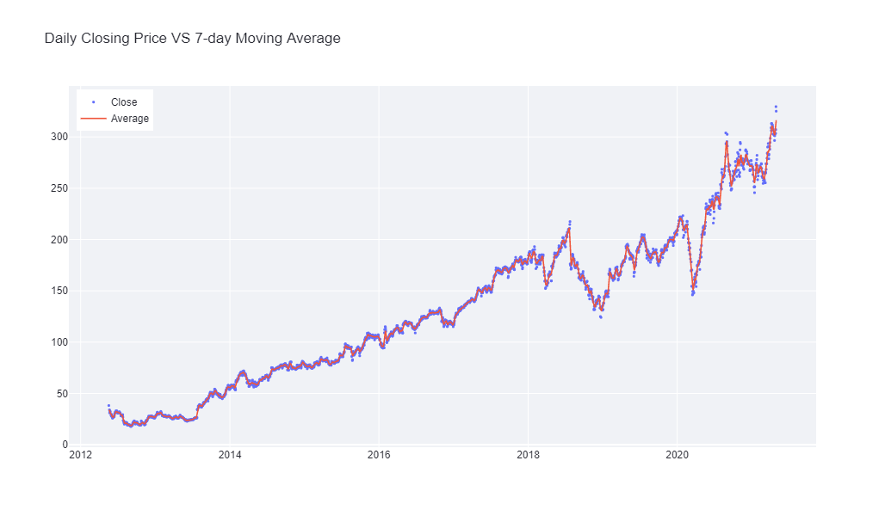
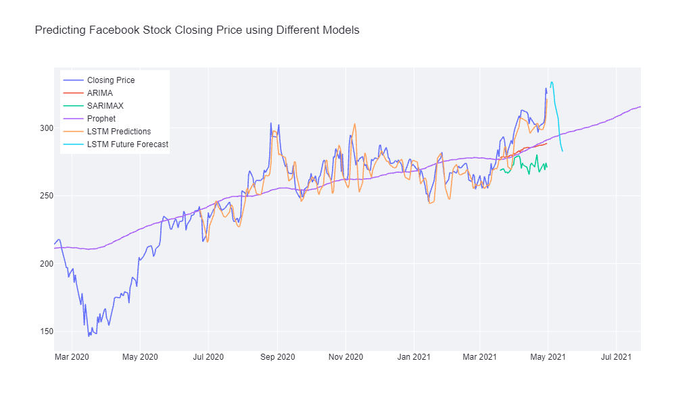

# Predicting Facebook Stock Price

## Built with

<code></code>
<code></code>
<code></code>
<code></code>

<code></code>
<code></code>

## Summary
This project is intend to apply time series forecasting algorithm by using Facebook Stock Price as an example. It is by no means a very practical method to help making decisions for investments. In fact, it is strictly not advisable to use this algorithm as a way to do so.

Models used involved: `ARIMA`, `SARIMAX`, `Prophet`, and `LSTM`. `LSTM` seems to perform very well when predicting ***one day*** into the future using **10 previous time steps**. It was able to capture the trends of rising and dropping in this case. Further explanation is available in the Web Application.

Thank you for checking out!

## Web Application
The Web App is accessible [here](https://share.streamlit.io/ansonnn07/predicting-facebook-stock-price/main/app.py) which you can directly see all the visualizations made.

## Some Visualizations

